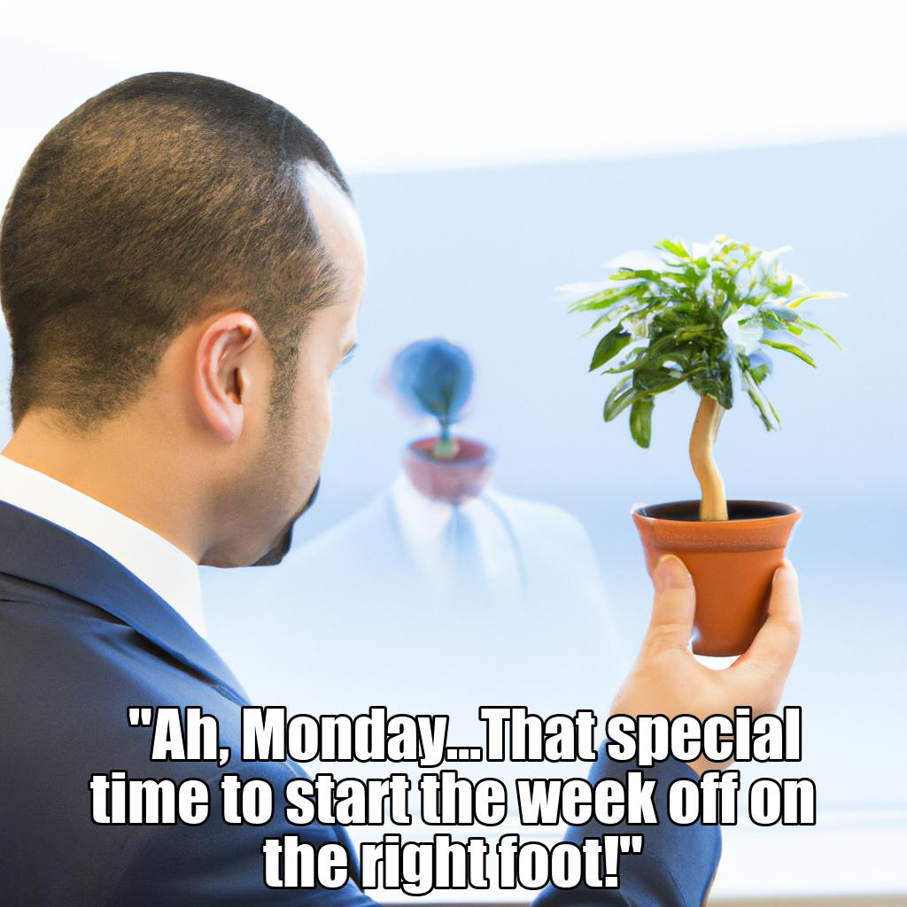
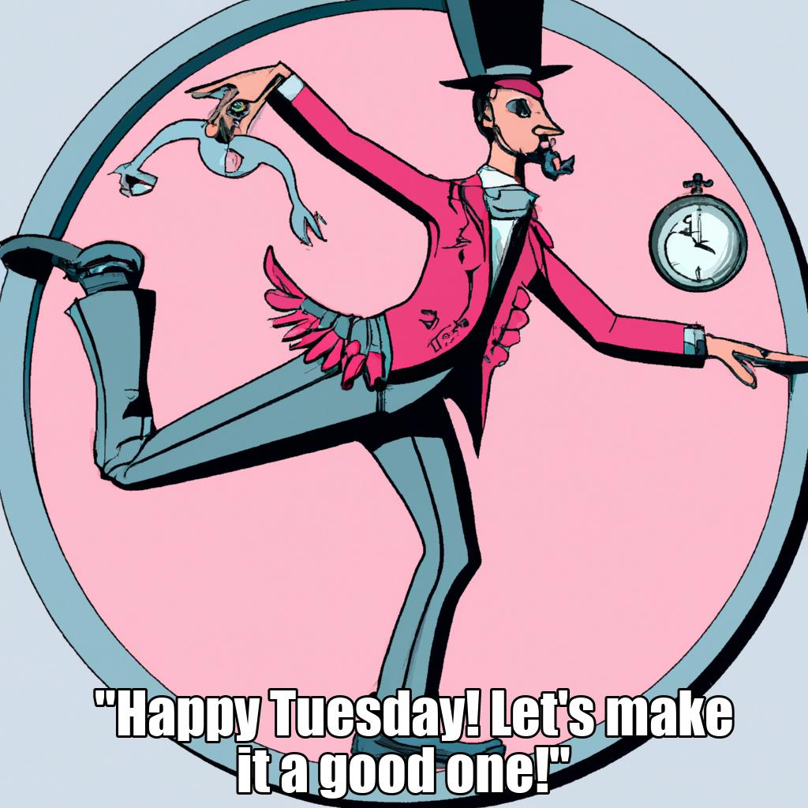
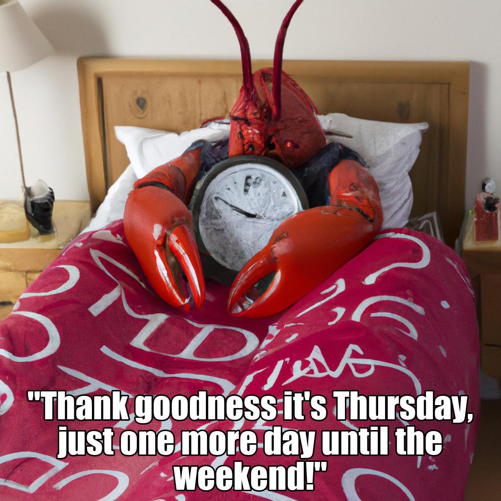
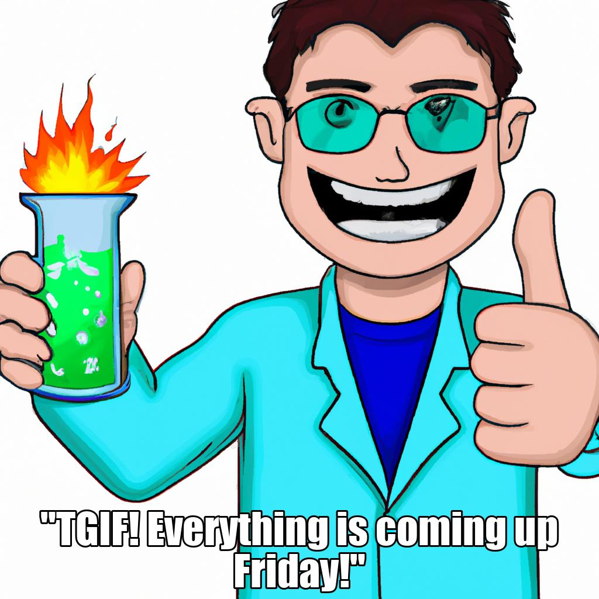
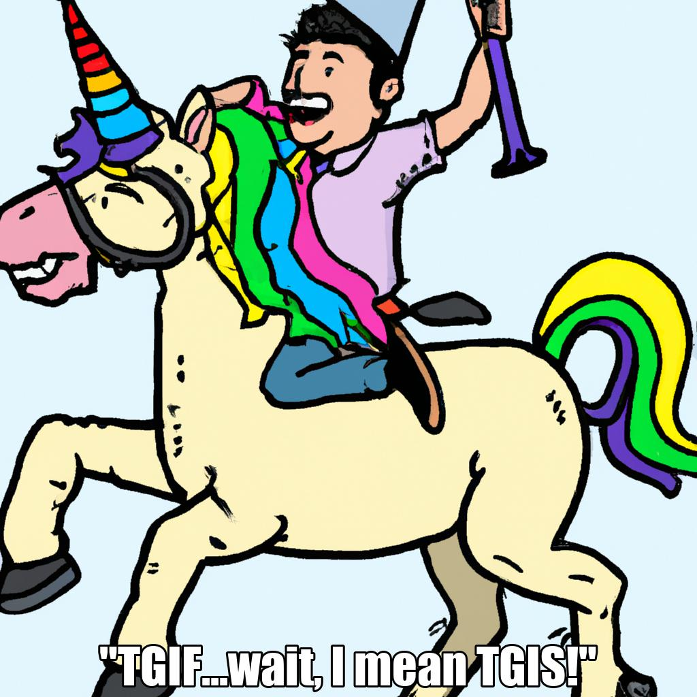
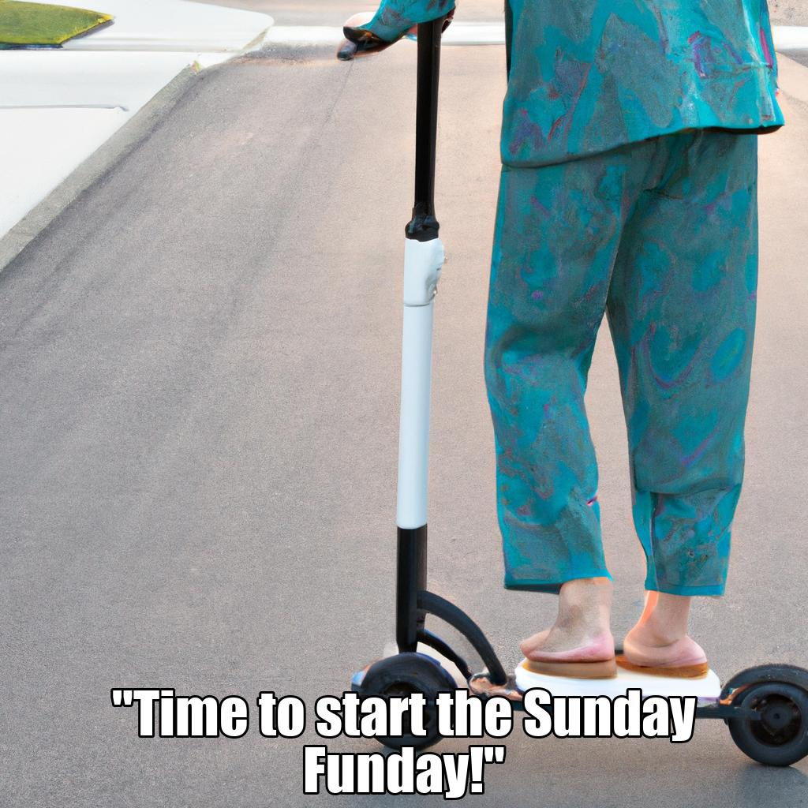

# openai-maas
Module to generate memes leveraging OpenAI's API with the [openai python module](https://github.com/openai/openai-python).

## Installation

```
pip install openai-maas
```

## Usage

You'll first need to get an api key from OpenAI.
* https://beta.openai.com/account/api-keys

```
from openai_maas import OpenAIMaaS
from pprint import pprint as pp


maas = OpenAIMaaS(
    openai_api_key="SECRET_API_KEY"
)

pp(maas.dotw_meme())
```

### dotw_meme( day=None )

Generates a meme for this day of the week. Returns information about the prompt used to generate the image and the caption used in the image. The generated image will be added to your current working directory named `image.jpg`, the captioned image will be added to your current working directory as `edited_image.jpg`.

The general process is:

* Ask OpenAI text completion for an image prompt related to the day.
* Ask OpenAI image generation to generate an image with that prompt.
* Ask OpenAI text completion for a meme caption related to today.
* Combine the image and the caption with [Pillow](https://pillow.readthedocs.io/en/stable/)
* ❓❓❓❓
* 💰

#### Examples

**Monday**


**Tuesday**


**Wednesday**


**Thursday**


**Friday**


**Saturday**


**Sunday**

